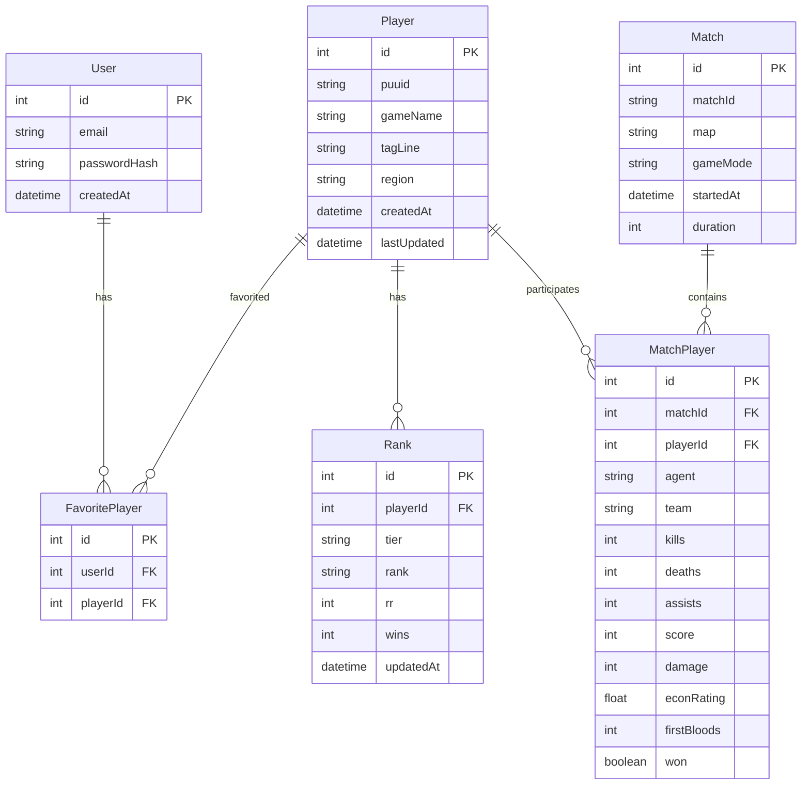

# Web-Services-CWK1

```mermaid
erDiagram

    User {
        int id PK
        string email
        string passwordHash
        datetime createdAt
    }

    FavoritePlayer {
        int id PK
        int userId FK
        int playerId FK
    }

    Player {
        int id PK
        string puuid
        string gameName
        string tagLine
        string region
        datetime createdAt
        datetime lastUpdated
    }

    Rank {
        int id PK
        int playerId FK
        string tier
        string rank
        int rr
        int wins
        datetime updatedAt
    }

    Match {
        int id PK
        string matchId
        string map
        string gameMode
        datetime startedAt
        int duration
    }

    MatchPlayer {
        int id PK
        int matchId FK
        int playerId FK
        string agent
        string team
        int kills
        int deaths
        int assists
        int score
        int damage
        float econRating
        int firstBloods
        boolean won
    }

    User ||--o{ FavoritePlayer : has
    Player ||--o{ FavoritePlayer : favorited

    Player ||--o{ Rank : has

    Match ||--o{ MatchPlayer : contains
    Player ||--o{ MatchPlayer : participates

```