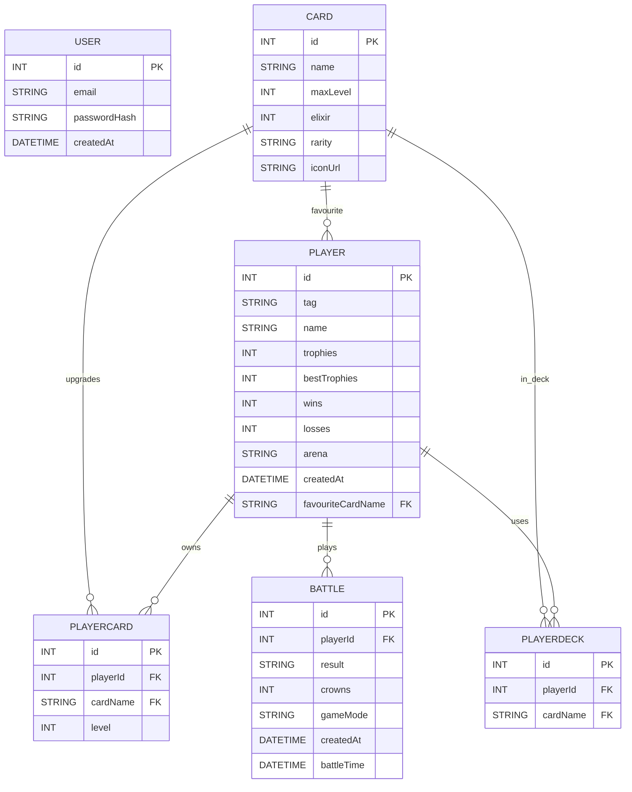

# Web-Services-CWK1

```mermaid
erDiagram

    USER {
        INT id PK
        STRING email
        STRING passwordHash
        DATETIME createdAt
    }

    PLAYER {
        INT id PK
        STRING tag
        STRING name
        INT trophies
        INT bestTrophies
        INT wins
        INT losses
        STRING arena
        DATETIME createdAt
        STRING favouriteCardName FK
    }

    BATTLE {
        INT id PK
        INT playerId FK
        STRING result
        INT crowns
        STRING gameMode
        DATETIME createdAt
        DATETIME battleTime
    }

    PLAYERCARD {
        INT id PK
        INT playerId FK
        STRING cardName FK
        INT level
    }

    PLAYERDECK {
        INT id PK
        INT playerId FK
        STRING cardName FK
    }

    CARD {
        INT id PK
        STRING name
        INT maxLevel
        INT elixir
        STRING rarity
        STRING iconUrl
    }

    PLAYER ||--o{ BATTLE : plays
    PLAYER ||--o{ PLAYERCARD : owns
    PLAYER ||--o{ PLAYERDECK : uses
    CARD   ||--o{ PLAYERCARD : upgrades
    CARD   ||--o{ PLAYERDECK : in_deck
    CARD   ||--o{ PLAYER : favourite

```