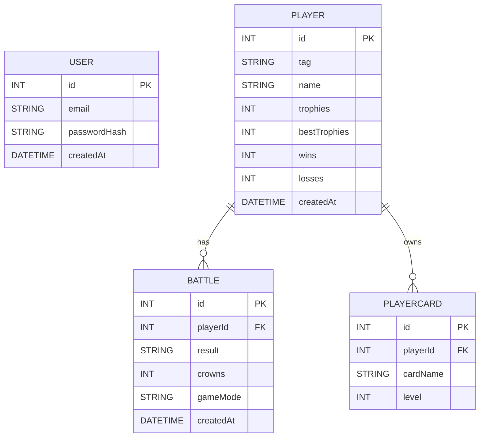

# Web-Services-CWK1

```mermaid
erDiagram

    USER {
        INT id PK
        STRING email
        STRING passwordHash
        DATETIME createdAt
    }

    PLAYER {
        INT id PK
        STRING tag
        STRING name
        INT trophies
        INT bestTrophies
        INT wins
        INT losses
        DATETIME createdAt
    }

    BATTLE {
        INT id PK
        INT playerId FK
        STRING result
        INT crowns
        STRING gameMode
        DATETIME createdAt
    }

    PLAYERCARD {
        INT id PK
        INT playerId FK
        STRING cardName
        INT level
    }

    PLAYER ||--o{ BATTLE : has
    PLAYER ||--o{ PLAYERCARD : owns

```